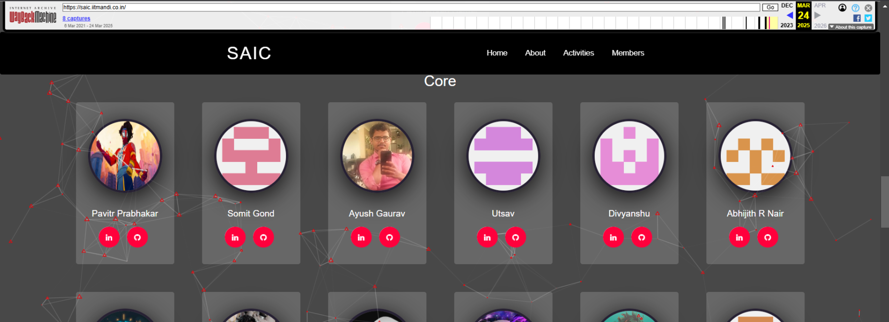

## Back In Time - 2

So the challenge here says that there was a mole and they kicked him out, and they say "our website" meaning he was present in their website.

Now what we have to do is use waybackurl and enter `https://saic.iitmandi.co.in/`. 

After searching a bit you will see that there's a latest screenshot of website and that one stood out since it's recent one.

After that I copied all username of the old website and pasted in notepad then tallied each username with current website member and found out that there's Pavitra Prabhakar which is standing out. 

Then go to his GitHub and there we found flag in the readme.md 

`saic{p@v1tr_g0t_c4ugh7_1n_w4yb4ck_w3b!!}`
