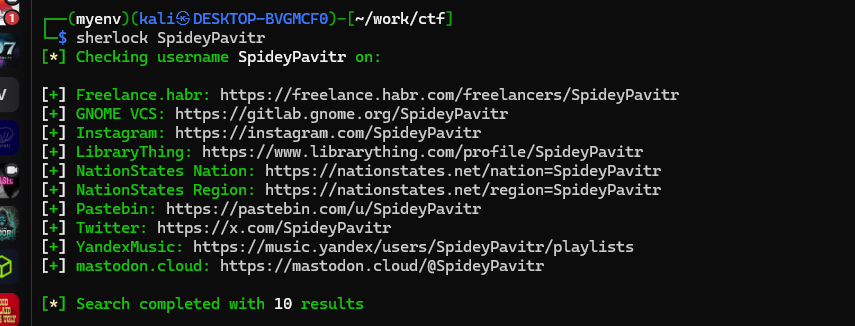
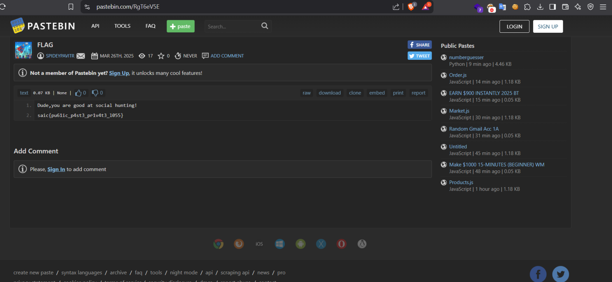

## This challenge Hunt them down across the web

We get the username of Pavitr Prabhakar which is `SpideyPavitr` from GitHub.

Now we use the GOAT tool known as `Sherlock`.


So after running the command `sherlock SpideyPavitr`:

I got several URLs and checked them and found the flag on `pastebin.com/u/SpideyPavitr`




```
Dude,you are good at social hunting!
saic{pu61ic_p4st3_pr1v4t3_l055}
```


