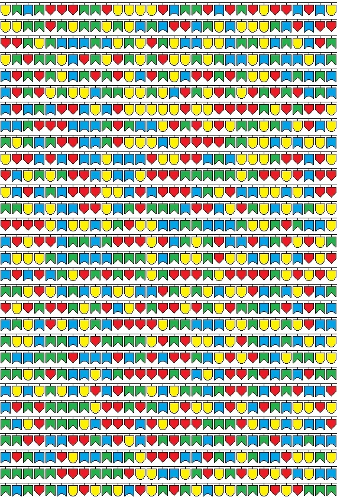
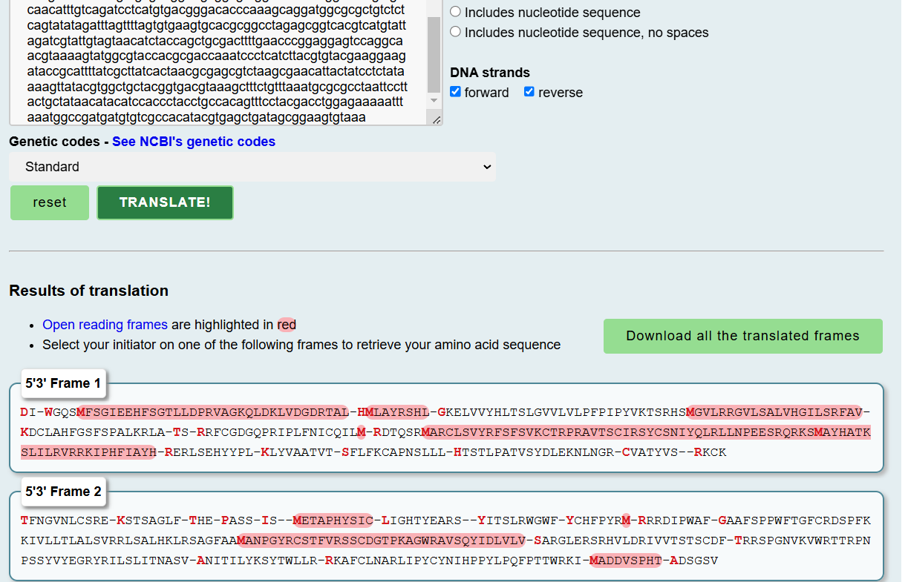

# Transcription, Translation, ORFs 

Provided image:




## Description:

```
I accidentally sent the data to the wrong Forensics Department! They say they found data, but we can’t really make anything out of it. Can you?“

Hint: Think out of the box

Note: Report the flag in the format SAIC{flag}
``` 

> We've been provided with a image, after analysing a bit i found out that it's probably nucleotides (the challenge description said think out of box also the title is transcription, translation - Bio student BTW ^^)

> So after knowing that this is nucleotides I had a good conversation with Claude, Deepseek and ChatGPT and came to conclusion that there are 4 colours for different amino acids in DNA:  
> - Blue: C  
> - Red: T  
> - Yellow: G  
> - Green: A   

> Based on this I created a script with help of teammate:

```python
import cv2
import numpy as np

def classify_color(bgr):
    """Classify a BGR pixel as Red, Blue, Green, or Yellow."""
    b, g, r = bgr

    if r > 150 and g > 150 and b < 150:  # More accurate Yellow condition
        return "Yellow"
    elif r > g and r > b:
        return "Red"
    elif g > r and g > b:
        return "Green"
    elif b > r and b > g:
        return "Blue"
    else:
        return "Unclassified"

def get_middle_pixels(image_path, grid_x, grid_y):
    """Divides the image into a grid and gets the middle pixel of each cell."""
    img = cv2.imread(image_path, cv2.IMREAD_COLOR)
    if img is None:
        raise FileNotFoundError(f"Error: Could not load image at {image_path}")

    height, width, _ = img.shape  
    cell_width = width // grid_x
    cell_height = height // grid_y

    middle_pixels = []

    for i in range(grid_y):
        for j in range(grid_x):
            mid_x = j * cell_width + cell_width // 2
            mid_y = i * cell_height + cell_height // 2
            mid_x = min(mid_x, width - 1)
            mid_y = min(mid_y, height - 1)

            middle_pixel = img[mid_y, mid_x]  
            middle_pixels.append(((mid_x, mid_y), middle_pixel))
    
    return middle_pixels

# Image path and grid size
image_path = "image.jpg"  
grid_x, grid_y = 30, 30  

# Color-to-nucleotide dictionary (Updated Pairing)
color_to_nucleotide = {
    "Yellow": "G",
    "Red": "T",
    "Green": "A",
    "Blue": "C"
}

# Extract middle pixels
pixels = get_middle_pixels(image_path, grid_x, grid_y)

# Convert colors to nucleotide sequence
nucleotide_sequence = []
for coord, value in pixels:
    color = classify_color(value)
    nucleotide = color_to_nucleotide.get(color, "N")  # 'N' for unclassified colors
    nucleotide_sequence.append(nucleotide)
    print(f"Middle pixel at {coord}: {value} ({color}) → {nucleotide}")

# Join nucleotides into a sequence
final_sequence = "".join(nucleotide_sequence)
print("\nGenerated DNA sequence:")
print(final_sequence)
```


After this I got 
```
GACATTTAATGGGGTCAATCTATGTTCTCGGGAATAGAAGAGCACTTCAGCGGGACTCTTTTAGACCCACGAGTAGCCGGCAAGCAGCTAGATAAGCTAGTAGATGGAGACCGCACCGCACTATAGCATATGCTAGCTTATAGGTCACACCTATGAGGCAAGGAGCTAGTAGTATATCACCTCACTTCGCTGGGGGTGGTTTTAGTATTGCCATTTCCCATACCGTATGTGAAGACGTCGAGACATTCCATGGGCGTTTTAAGGCGCGGCGTTCTCTCCGCCCTGGTTCACGGGATTCTGTCGAGATTCGCCGTTTAAAAAGATTGTCTTGCTCACTTTGGCTCTTTCAGTCCGGCGCTTAAGCGCCTTGCATAAACTTCGTAGCGCAGGTTTTGCGGCGATGGCCAACCCAGGATACCGCTGTTCAACATTTGTCAGATCCTCATGTGACGGGACACCCAAAGCAGGATGGCGCGCTGTCTCTCAGTATATAGATTTAGTTTTAGTGTGAAGTGCACGCGGCCTAGAGCGGTCACGTCATGTATTAGATCGTATTGTAGTAACATCTACCAGCTGCGACTTTTGAACCCGGAGGAGTCCAGGCAACGTAAAAGTATGGCGTACCACGCGACCAAATCCCTCATCTTACGTGTACGAAGGAAGATACCGCATTTTATCGCTTATCACTAACGCGAGCGTCTAAGCGAACATTACTATCCTCTATAAAAGTTATACGTGGCTGCTACGGTGACGTAAAGCTTTCTGTTTAAATGCGCGCCTAATTCCTTACTGCTATAACATACATCCACCCTACCTGCCACAGTTTCCTACGACCTGGAGAAAAATTTAAATGGCCGATGATGTGTCGCCACATACGTGAGCTGATAGCGGAAGTGTAAA
```

### Now that We have a code lets try to decode it as mentioned in title (translation) the step is to translate this code.

We use `https://web.expasy.org/translate/` to translate.

And Now after translating and analyzing I got this! 




`THE-PASS-IS--METAPHYSIC-LIGHTYEARS`
 
After this I bruteforced possible flags and got the flag 

`SAIC{METHAPHYSIC_LIGHTYEARS}`

