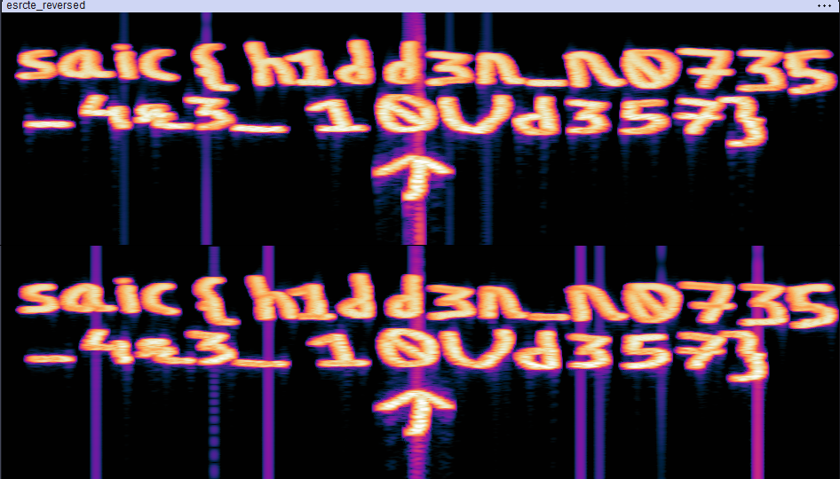

# 🏁 Challenge Writeup: Hidden Notes – Sonic Secrets Unveiled

> **Challenge Name:** Hidden Notes  
> **Category:** Forensics / Audio Analysis  
> **Challenge Type:** Forensic / Audio Reversal + Spectrogram Analysis   
> **File:** esrcte.awv  

---

## 🧩 Challenge Description

> Not everything you hear tells the full story. Sometimes, the real message lies beneath the surface, waiting to be discovered. Can you tune in and uncover what’s hidden?
> We were provided with a suspicious audio file: ```esrcte.awv```
> From the challenge prompt and filename, we suspected the message may be hidden inside the waveform — potentially in a spectrogram view.

---

## 🔍 Approach

We began by inspecting the file format using xxd:

```bash
xxd esrcte.awv | head
```
Output:
```hex
00000000: 4952 4646 bb38 0006 4157 4556 6d66 2074  IRFF.8..AWEVmf t
00000010: 0014 0000 0001 0002 5622 0000 5888 0001  ........V"..X...
```

We noticed the header begins with IRFF — this should be RIFF if the file were a valid WAV (WAVE) format. This hinted that the bytes might be reversed or corrupted in some predictable way.

---

## 🛠️ Solution Strategy

### Step 1: Byte-Pair Reversal
We wrote a Python script to reverse the bytes in pairs, which we suspected was how the file had been obfuscated.

```python
def reverse_bytes_by_pair(input_file, output_file):
    with open(input_file, 'rb') as f:
        data = f.read()
    reversed_data = bytearray()
    for i in range(0, len(data), 2):
        if i + 1 < len(data):
            reversed_data.append(data[i + 1])
            reversed_data.append(data[i])
    with open(output_file, 'wb') as f:
        f.write(reversed_data)
    print(f"file saved : {output_file}")

reverse_bytes_by_pair("esrcte.awv", "esrcte_reversed.awv")
```

### Step 2: Check File Signature
After running the script, we inspected the new file:

```bash
file esrcte_reversed.awv
```
Output:
```arduino
RIFF (little-endian) data, WAVE audio, Microsoft PCM, 16 bit, stereo 22050 Hz
```
Success! The reversed file was now a valid .wav file.

### Step 3: Spectrogram Visualization

We opened the corrected audio (esrcte_reversed.awv) in a spectrogram viewer such as:
- Sonic Visualiser
- Audacity (with Spectrogram view)

Immediately, we spotted clear text hidden in the frequency domain.

---

## 🖼️ Visual Confirmation
The spectrogram revealed the following flag: saic{h1dd3n_n0735_4r3_10Ud357}



---

## 🎯 Final Flag
```css
saic{h1dd3n_n0735_4r3_10Ud357}
```
