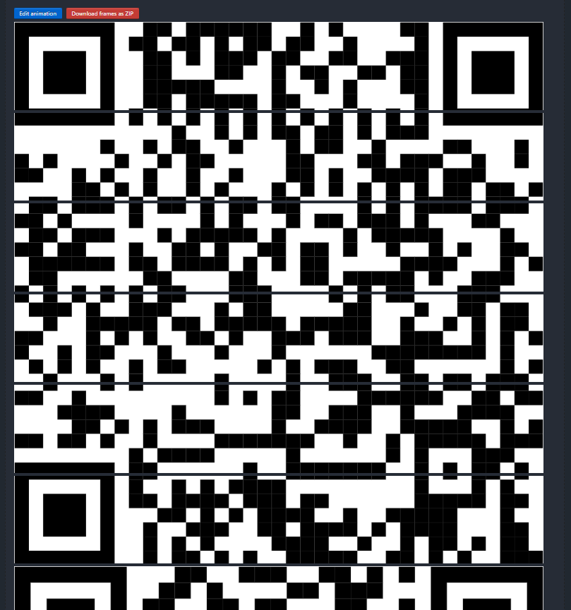

## giffy-5

We are given a gif file, which clearly appears to be chunks of qr code.

I run a [gif frame extractor](https://ezgif.com/)

ezgif automatically puts all the frames sequnce wise, which means i can scan the qr codes directly now. There appeared to be 5 qr codes. 

1st qr gives `enc flag - niop{k1wjg_yz4e3n_4z3_C4ggy1ro_n}`
3rd qr gives `key - vignere_it_is`

I quickly run vignere cipher with given key after removing the underscores, and we successfuly can decipher the flag.

Flag: `saic{g1ffy_fr4m3s_4r3_W4tch1ng_u}`
