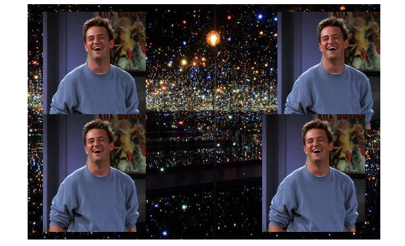
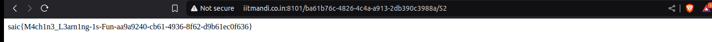

# 📸 Face Detection Quadrant Challenge

> **Challenge Name:** Face Detection  
> **Category:** Web / Visual Reasoning  
> **Challenge Type:** Observation & Pattern Recognition  
> **URL:** ```http://iitmandi.co.in:8101```  

---

## 📜 Description

> *"Mr. Bing is testing your ML and automation skills! Fetch the given image, detect Chandler’s face using a face detection model and determine which quadrants contain his face."*

> The challenge displayed an image containing **Chandler Bing’s** face in one or more quadrants. The task was to determine which **quadrants** (out of four) contained his face and input them in the format `[1, 3]`.

---

## 👁️ Manual Strategy

Instead of using machine learning or automation, the challenge was completed through **pure visual observation**.

---

## 📝 Step-by-step Approach:

### 1. Decoding Quadrant System:

The quadrant layout was not explicitly mentioned in the interface, so it had to be deduced manually.

### 2. Manually Observed Each Image:

By observing changes in the URL/page structure and comparing the position of Chandler’s face in various images, the following mapping was derived:
- Top-left → Quadrant 1
- Top-right → Quadrant 2
- Bottom-right → Quadrant 3
- Bottom-left → Quadrant 4

This reference grid was applied consistently throughout the challenge.

```yaml
+---------+---------+  
|    1    |    2    |   
+---------+---------+  
|    1    |    2    |  
+---------+---------+  
```

### 3. Entered Answer Manually  
   
Submitted the identified quadrants as per the expected format, e.g. `[2, 3]`.

### 4. Repeated for 52 Rounds  
   
Completed the process 52 times until the final flag was revealed.

---

## 🖼️ Sample Reference Image

Here’s an example used during the challenge:



In this image, Chandler appears in **all four quadrants**, so the correct input would be:

```text
[1, 2, 3, 4]
```

Flag after doing for 52 times:



---

## 🏁 Flag
```css
saic{M4ch1n3_L34rn1ng-1s-Fun-aa9a9240-cb61-4936-8f62-d9b61ec0f636}
```

---

## 🔍 Reflections
Even though the challenge hinted at automation and ML, it was designed in a way that allowed for human problem-solving through precision and pattern recognition.
