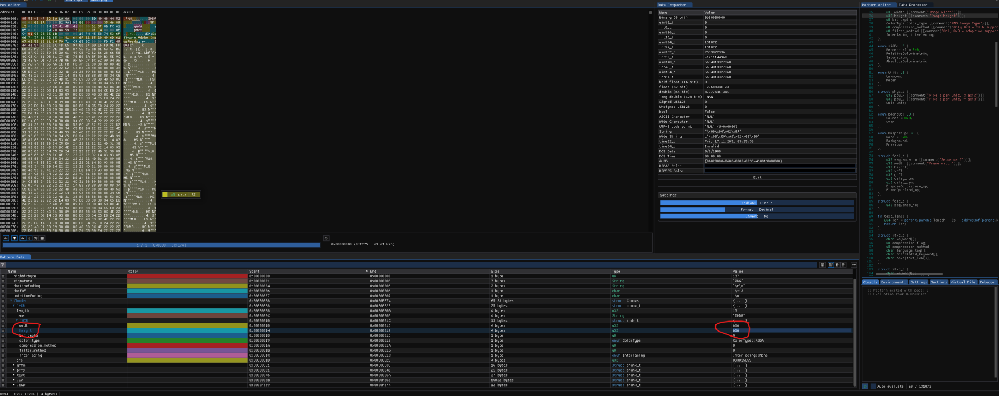

# 🏁 Challenge Writeup: Size Doesn’t Matter – Reveal the Hidden Flag

> Challenge Name: Size doesn't matter  
> Category: Forensics / Steganography   
> Challenge Type: PNG Header Tampering   

---

## 🧩 Challenge Description

> We were given a PNG file m100.png that appeared broken or partially corrupted. When opened, only a part of the image was visible, with a hint of some hidden text.
> The challenge title, "Size doesn’t matter – maybe she lied", suggested the image might not be broken, but incompletely rendered — potentially due to incorrect metadata in the PNG header.

---

## 🔍 Approach

Opening the image in a viewer revealed only a partial render — we could faintly see the top of what looked like flag text.


This confirmed our suspicion: the image data exists, but something is causing it to be cropped. We moved to inspect the file in a hex editor.

Using 010 Editor with the PNG binary template loaded, we analyzed the internal structure of the PNG. We observed the following in the IHDR (image header) chunk:


Width was correct.

Height was set to 137, which seemed unusually small for the amount of data in the file.


This told us the image was likely being truncated due to the declared height — not because the file was corrupted or missing data.

---

## 🛠️ Solution Strategy

### Step 1: Modify the Height
We edited the PNG file directly in the hex editor, changing the height value in the IHDR chunk from:

```ini
Height = 137 → 666
```
This forces image viewers to render more vertical pixels, potentially uncovering hidden image data.

### Step 2: Save and Reopen
We saved the edited image as m100_fixed.png, then opened it in a regular image viewer.

### Step 3: Full Flag Revealed
Success! The full image rendered and revealed the complete flag at the bottom of the image.


---

## 🎯 Final Flag
```css
flag{s1z3_d03s_m4773r_baby}
```
