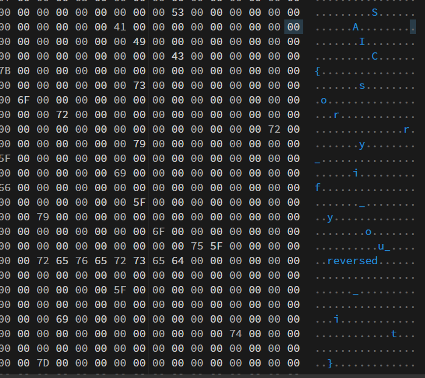

## neko neko
> **Category:** misc  
> **File:** ```neko```

### Challenge Overview
The challenge provided a Linux executable that was designed to crash due to a deliberate segmentation fault, eliminating dynamic analysis as an option.

### Static Analysis & Strategy
- **Reverse Engineering:**  
    Using Dogbolt to decompile revealed that the program intentionally causes a segmentation fault. Thus, relying solely on dynamic execution would not yield insight into the problem.

- **Hexadecimal Inspection:**  
    Switching to a hex editor, I examined the binary file for any anomalies. Scrolling through the hexadecimal data revealed fragments of what appears to be a flag.




### Conclusion
The solution hinged on careful static file analysis rather than conventional dynamic execution. By leveraging a hex editor, the flag was successfully reconstructed from dispersed data segments within the executable.

**Flag:** SAIC{sorry_if_you_reversed_it}
